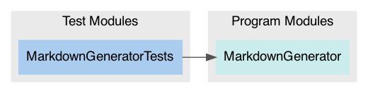

# Package: **MarkdownGenerator**

## Products

List of products in this package:

| Product | Type | Targets |
| ------- | ---- | ------- |
| MarkdownGenerator | Library (automatic) | MarkdownGenerator |

_Libraries denoted 'automatic' can be both static or dynamic._

## Modules

### Program Modules

| Module | Type | Dependencies |
| ------ | ---- | ------------ |
| MarkdownGenerator | Regular |  |

### Test Modules

| Module | Type | Dependencies |
| ------ | ---- | ------------ |
| MarkdownGeneratorTests | Test | MarkdownGenerator |

### Module Dependency Graph

## External Dependencies

This package has zero dependencies 🎉

## Requirements

This file was generated by [SourceDocs](https://github.com/eneko/SourceDocs) on 2020-05-13 20:32:11 +0000